- [Introduction](#introduction)
- [Prerequisites](#prerequisites)
  - [ODF Storage Considerations](#odf-storage-considerations)
  - [Create Machinesets](#create-machinesets)
    - [VIA CLI](#via-cli)
    - [Via UI](#via-ui)
- [ODF UI Operator Installation](#odf-ui-operator-installation)
  - [Optional: Local Storage Operator](#optional-local-storage-operator)
  - [ODF Storage Serving Option 1: Multicloud Object Gateway](#odf-storage-serving-option-1-multicloud-object-gateway)
  - [ODF Storage Serving Option 2: Noobaa](#odf-storage-serving-option-2-noobaa-1)
- [ODF CLI Operator Installation](#odf-operator-installation)
  - [Label Nodes](#label-nodes)
  - [ODF Operator Installation](#odf-operator-installation)
  - [Optional: Local Storage Operator](#optional-local-storage-operator-1)
  - [ODF Storage Serving Option 1: Multicloud Object Gateway](#odf-storage-serving-option-1-multicloud-object-gateway-1)
  - [ODF Storage Serving Option 2: Noobaa](#odf-storage-serving-option-2-noobaa-1)

# Introduction

In order to install and successfully configure Quay as a reliable enterprise registry, a solid storage solution needs to be provided. While it is possible to bring an 3rd party storage provider into the equation. This guide focuses on standing up OpenShift Data Foundation. Both the storage preparation and the installation and configuration can both be done via the commandline `oc` utility as well as through the OpenShift Console.

The commandline is more automatable and focuses on creating the required `yaml` files in order to deploy all of the required components with predefined options selected ahead of time and built into the deployment process.

The UI provides a more approachable way to discover the options which may be available. These options are often exposed in a wizard style format and can help users figure out what configurations are available for a given choice.

This specific guide is focused solely on options relevant to deploy to OpenShift 4.x on top of VMWare. While there is a lot of overlap for other deployment types (AWS, GCP, Azure etc) their specifics might vary wildly and therefore this guide should only be used as a rough approximation of how one might go about configuration Quay with ODF on other providers.

# Prerequisites

Regardless of whether installing via the CLI or the UI, ODF requires that decisions be made about both the backend storage which will support ODF as well as how ODF will be deployed to OpenShift.

## ODF Storage Considerations

When working within a VMWare environment there are a couple of options provided that the cluster was installed via the IPI method.

First, it is possible to let the VMWare CSI driver dynamically provision the persistent volume claims (PVC) for the Red Hat OpenShift Data Foundation (RHODF) storage backend. This means that no additional configuration is required.

Second, the operator could opt to use the Local Storage Operator (LSO) and attach their own disks to the vms that are hosting ODF.

Both options have their advantages, and both are supported options within OpenShift.

> [!WARNING]
> If the cluster was installed via UPI, as of the time of this writing the only option is to use the local storage operator.

## Create Machinesets

The base requirement is that there are 3 nodes able to host ODF. According to [the official documentation](https://access.redhat.com/documentation/en-us/red_hat_openshift_data_foundation/4.12/html/planning_your_deployment/infrastructure-requirements_rhodf) ODF requires 30 vCPUs and 72G of ram across the 3 nodes. Below is a sample MachineSet definition that will meet the minimum requirements with a little bit of extra ram for overhead. Regardless of whether you install via the UI or the CLI, if you are creating machinesets for your ODF deployment the following Machineset can be used.

> [!NOTE]
> The following definition needs to be adjusted for your environment

```
apiVersion: machine.openshift.io/v1beta1
kind: MachineSet
metadata:
  name: odf-workers-0
  namespace: openshift-machine-api
spec:
  replicas: 3
  selector:
    matchLabels:
      machine.openshift.io/cluster-api-cluster: <infra_id>
      machine.openshift.io/cluster-api-machineset: <infra_id>-worker-0
  template:
    metadata:
      labels:
        machine.openshift.io/cluster-api-machine-role: worker
        machine.openshift.io/cluster-api-machine-type: worker
        machine.openshift.io/cluster-api-cluster: <infra_id>
        machine.openshift.io/cluster-api-machineset: <infra_id>-worker-0
    spec:
      metadata:
        labels:
          storage: odf
          cluster.ocs.openshift.io/openshift-storage: ''
          node-role.kubernetes.io/infra: ''
          node-role.kubernetes.io/worker: ''
      providerSpec:
        value:
          numCoresPerSocket: 1
          diskGiB: 120
          snapshot: ''
          userDataSecret:
            name: worker-user-data
          memoryMiB: 28672
          credentialsSecret:
            name: vsphere-cloud-credentials
          network:
            devices:
              - networkName: VM Network
          numCPUs: 11
          kind: VSphereMachineProviderSpec
          workspace:
            datacenter: <datacentre>
            datastore: /<datacentre>/datastore/OCP
            folder: /<datacentre>/vm/<infra_id>
            resourcePool: /<datacentre>/<resource pool>
            server: vcenter.x86experts.com
          template: <infra_id>-rhcos-generated-region-generated-zone
          apiVersion: machine.openshift.io/v1beta1
      taints:
        - effect: NoSchedule
          key: node.ocs.openshift.io/storage
          value: 'true'
```

> [!WARNING]
> If you chose not to use a Machineset, you must label the nodes yourself.

### VIA CLI

After you have created the `odf_machineset.yaml`, simply apply it to the cluster:

```
oc apply -f odf_machineset.yaml -n openshift-machine-api
```

After several minutes you should see the following:

```
$ oc get machineset -n openshift-machine-api
NAME                      DESIRED   CURRENT   READY   AVAILABLE   AGE
odf-workers-0             3         3         3       3           21h
```

### Via UI

# ODF UI Operator Installation

### Install ODF Operator Via The UI

In the UI, as a cluster admin user, navigate to **Operators --> Operators --> Operator Hub** and filter for ODF:

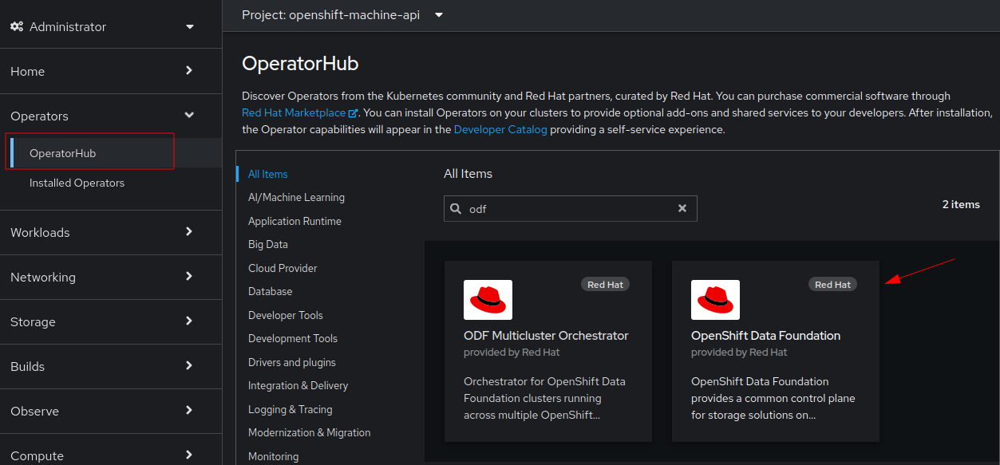

On the next screen just click install. There are no configurable options on this screen.

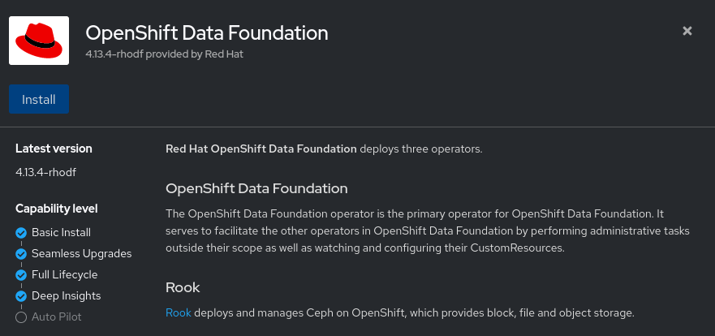

Finally, it is safe to accept the defaults. For more advanced users, these options can be adjusted.

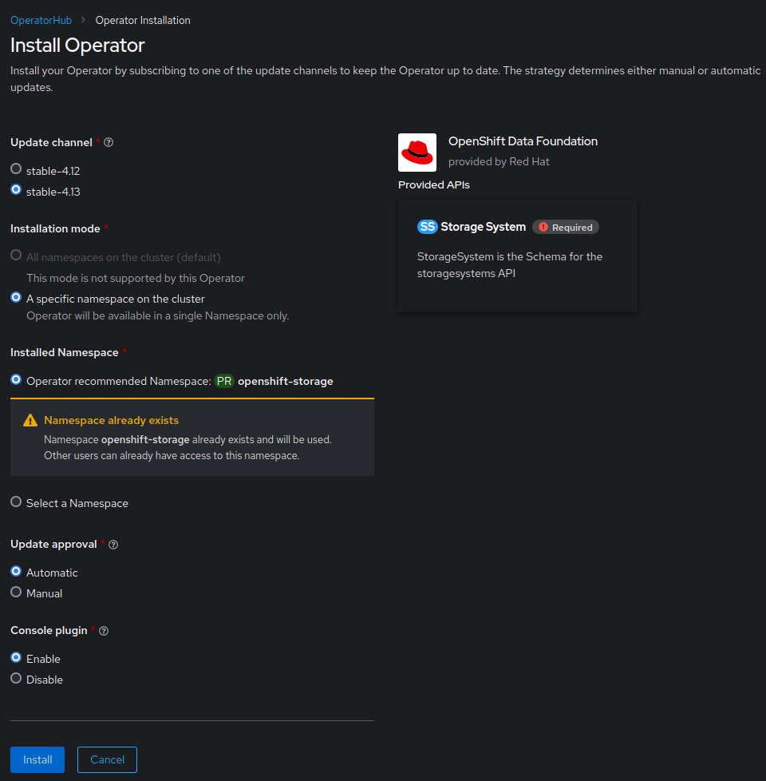

At this point the operator is installed and ready to be configured. Jump to either the Noobaa or Multicloud Object Gateway sections below

## Optional: Local Storage Operator

### Installing Local Storage Operator

To install the Local Storage Operator via the UI, click on **Operators --> OperatorHub** then filter for `local storage` and click on the `Local Storage provided by Red Hat` from the options below:

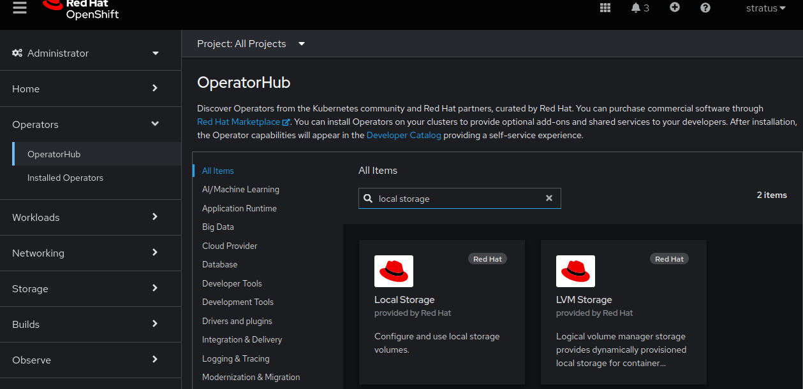

The next screen is basic information about the operator. Once the information has been reviewed, click `Install`

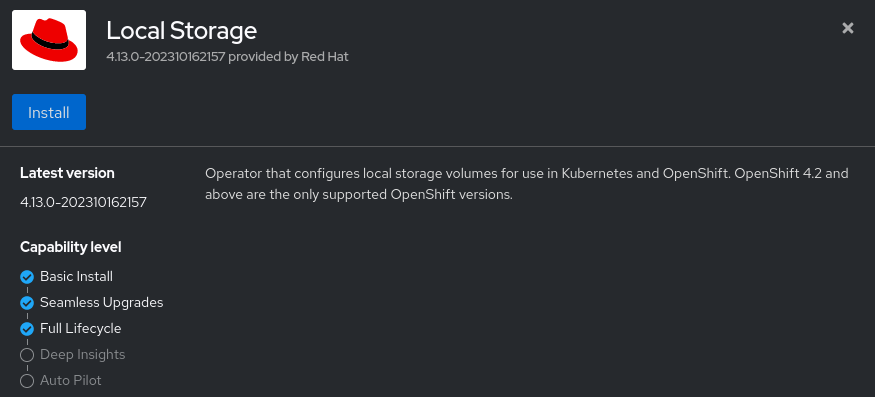

On the next screen, the default options are sufficient.

> [!NOTE]
> As in the screenshot below, if the `openshift-local-storage` namespace does not exist, it will be created during this process

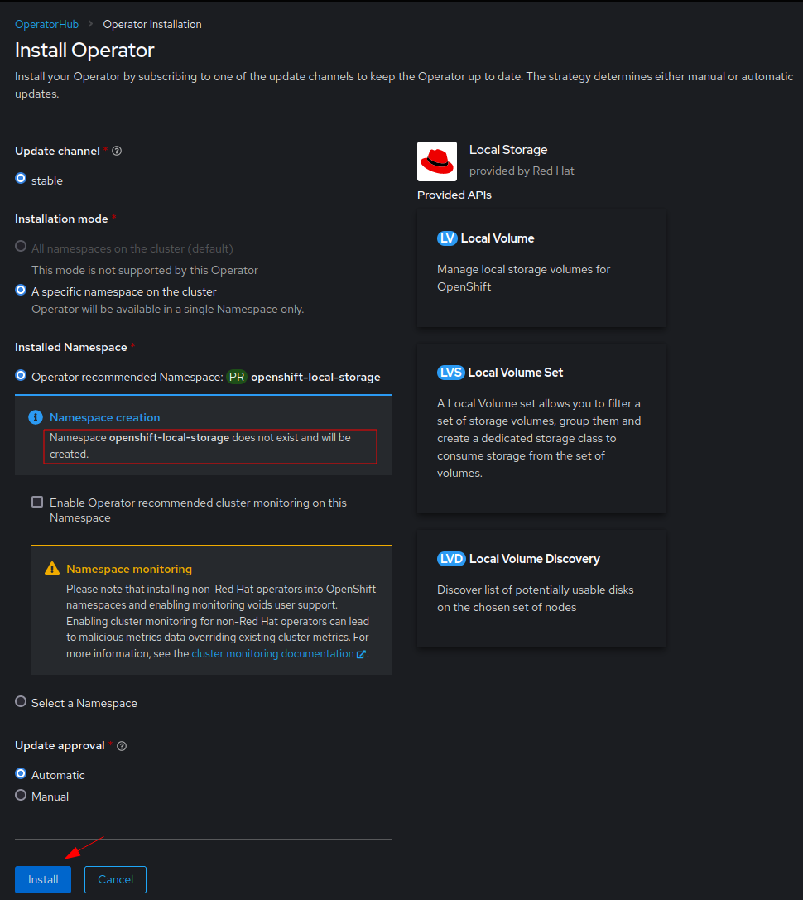

### Installing Local Storage Discovery

While there is an option to specify which drives in a system will be used for the Local Storage Operator, it is often preferable to use the `Local Storage Discovery`. This will allow OpenShift to scan the hosts and automatically determine which disks to add for local storage.

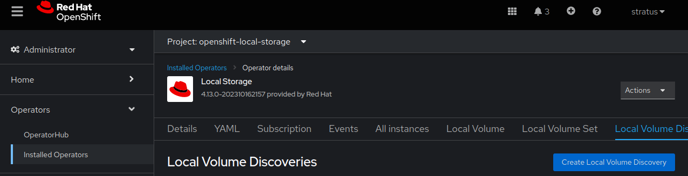

It is possible to use the form view to populate the appropriate options for the `LocalVolumeDiscovery`, however for this guide, the definition is fairly short and is simpler to insert the appropriate YAML definition.

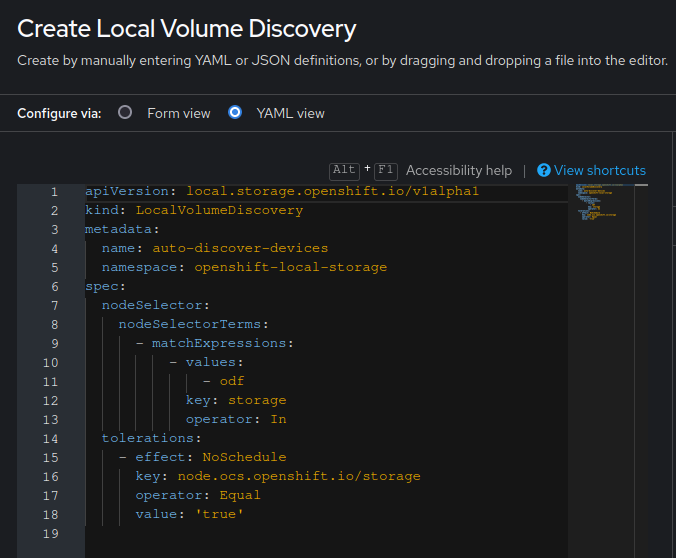

After creating the LocalVolumeDiscovery, you can click on the `auto-discover-devices` link.

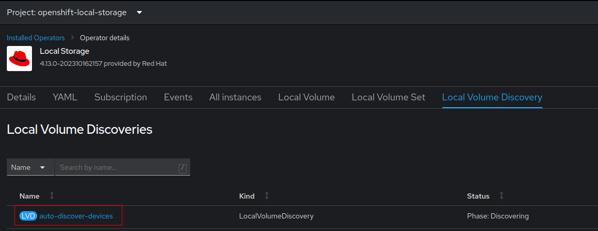

Viewing the events shows that the hosts are identified and the disks are found after a short period of time.

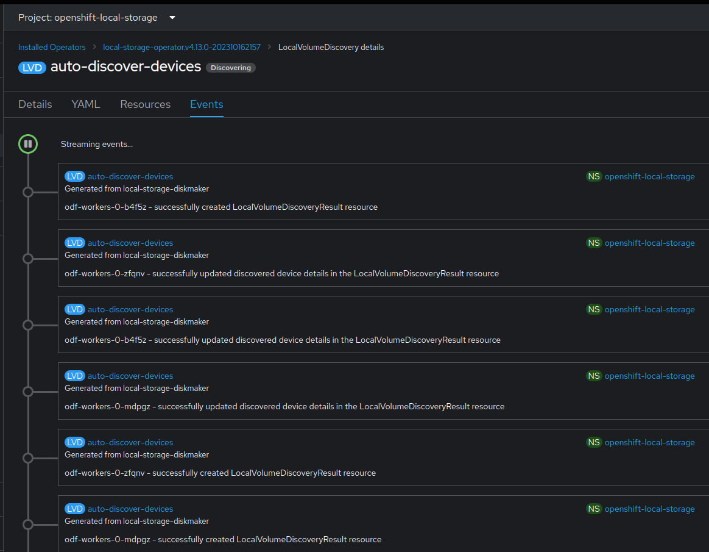

## ODF Storage Serving Option 1: Multicloud Object Gateway

> [!IMPORTANT]
> The OCP console UI needs to be refreshed before continuing or else the `Data Foundation` menu entry will not appear!

The next step is to create a Storage System for ODF to present to the cluster.

> [!WARNING]
> At the current time it is not recommended to follow the prompts of the ODF Operator post-install.

To create a Storage System click on **Storage --> Data Foundation --> Storage System**. Initially there should be a green check mark :white_check_mark: beside the `Data Foundation` in the Status section of the overview:

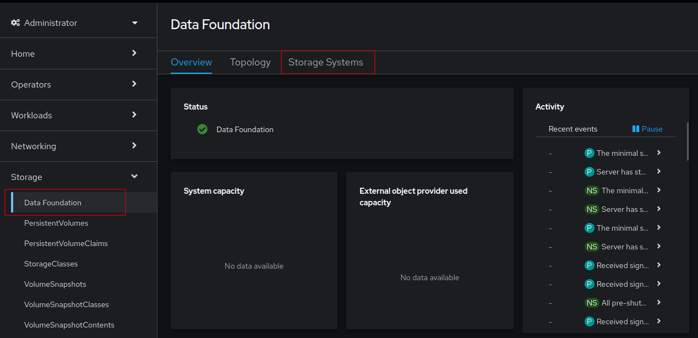

Click on `Create StorageSystem`:

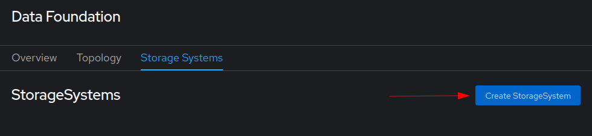

There are several storage backing options presented. In this guide, the Local Storage Operator is presented as an option but using the VMWare CSI driver (indicated via the Storage Class `thin-csi`) is the easiest option:

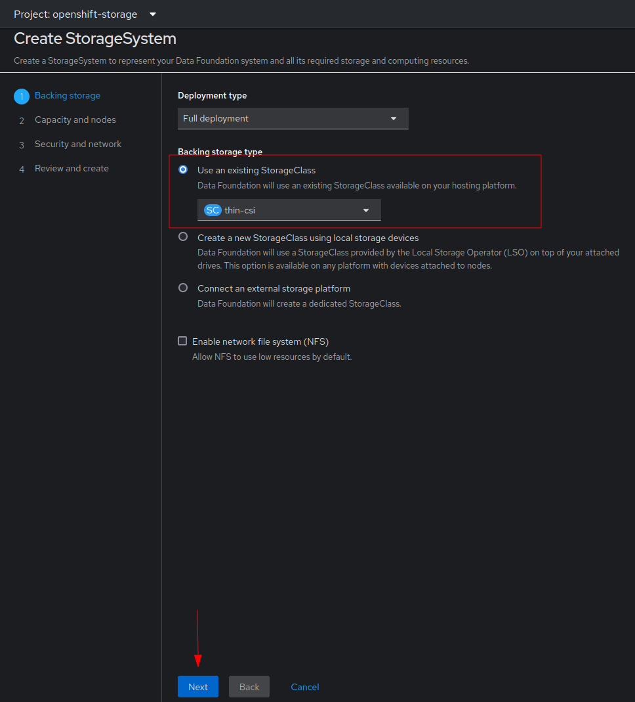

On the next screen, select the storage options that make sense for your environment in terms of capacity. If the machineset was created properly, the nodes in the ODF machineset will automatically be selected. If not, the appropriate nodes can be manually selected. Once confirmed the selected nodes will have the `cluster.ocs.openshift.io/openshift-storage` label applied to them for the deployment.

Optionally, taint the nodes to ensure they are dedicated to ODF. Click next when ready.

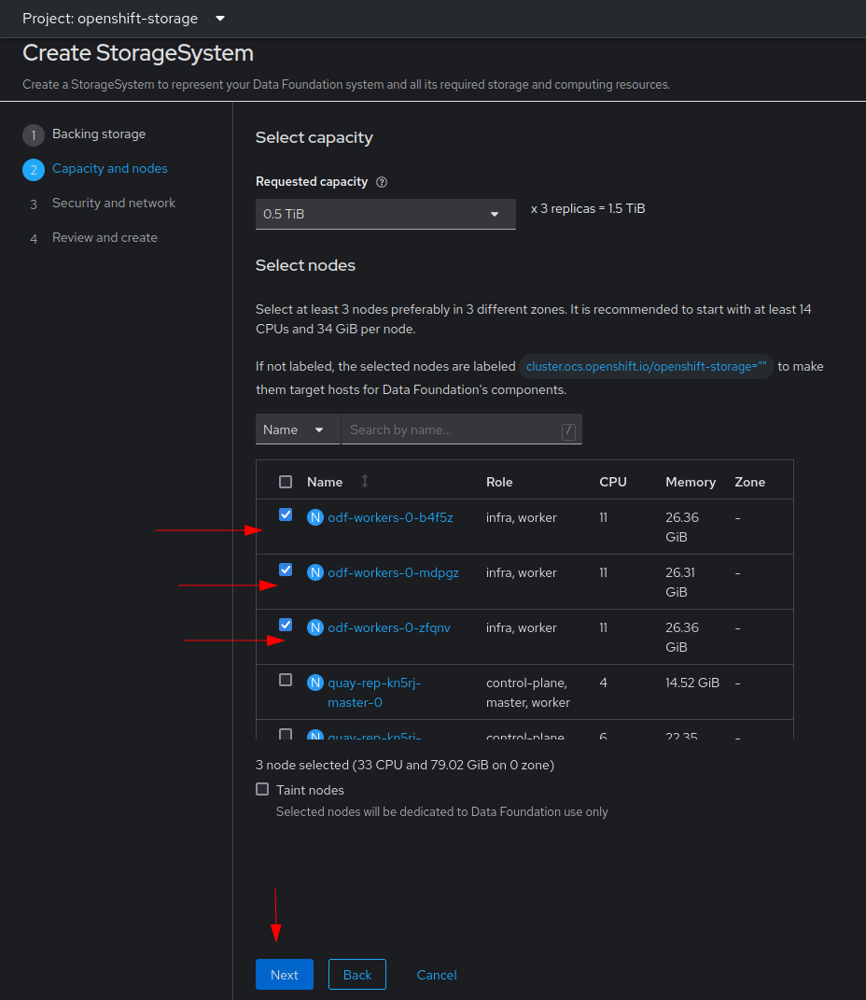

The next screen will provide encryption options as well as networking options, though at the time of writing only the `Default (SDN)` is supported.

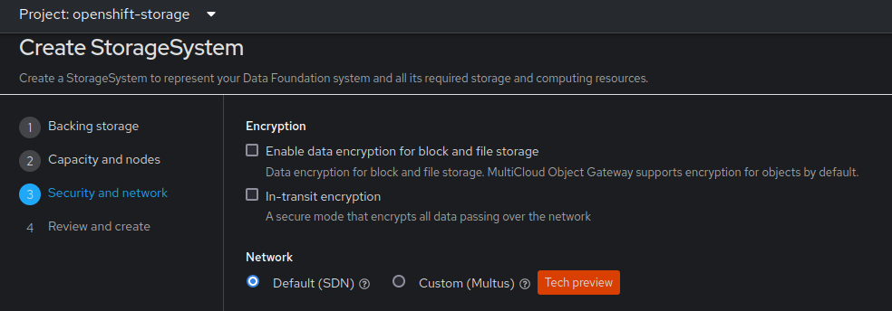

Finally confirm the previous selections by clicking `Create StorageSystem`
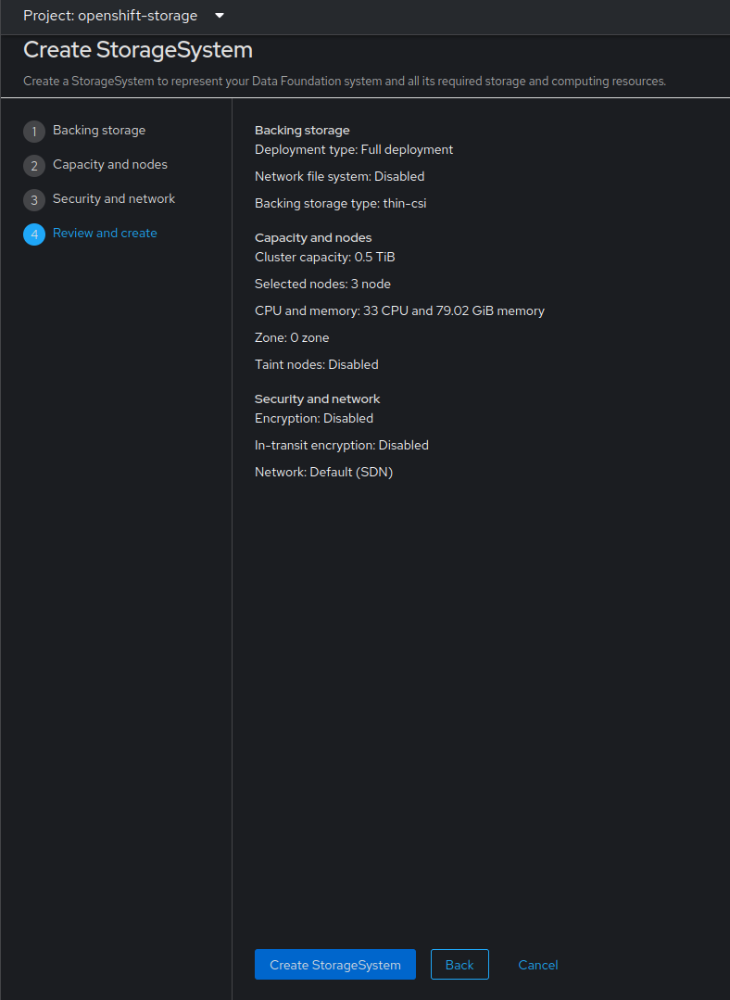

## ODF Storage Serving Option 2: Noobaa

If you do not have need for block or file storage provided by ODF you can opt to install only the Noobaa component. This consists of Noobaa itself as well as a BackingStore. The below definitions can have their resources adjusted based on how busy the environment is

```
echo '
apiVersion: noobaa.io/v1alpha1
kind: NooBaa
metadata:
  name: noobaa
  namespace: openshift-storage
spec:
 dbResources:
   requests:
     cpu: '2'
     memory: 8Gi
 dbType: postgres
 coreResources:
   requests:
     cpu: '2'
     memory: 8Gi
---
apiVersion: noobaa.io/v1alpha1
kind: BackingStore
metadata:
  finalizers:
  - noobaa.io/finalizer
  labels:
    app: noobaa
  name: noobaa-pv-backing-store
  namespace: openshift-storage
spec:
  pvPool:
    numVolumes: 1
    resources:
      requests:
        storage: 100Gi
  type: pv-pool
' | oc create -f -
```

After this a Noobaa backend should eventually become available. The Quay Operator will detect this automatically if the option to manage storage is turned on in Quay (which is its' default).

# ODF CLI Operator Installation

The above can be done in an scriptable fashion. The operator requires an Operator Group and a Subscription. Post-install configurations, with regards to Quay are documented in either the section for Noobaa or the Multicloud Object Gateway below.

You can use these definitions to install the operator

```
echo '
apiVersion: operators.coreos.com/v1
kind: OperatorGroup
metadata:
  name: openshift-storage-operatorgroup
  namespace: openshift-storage
spec:
  targetNamespaces:
  - openshift-storage
---
apiVersion: operators.coreos.com/v1alpha1
kind: Subscription
metadata:
  name: odf-operator
  namespace: openshift-storage
spec:
  channel: stable-4.13
  installPlanApproval: Automatic
  name: odf-operator
  source: redhat-operators
  sourceNamespace: openshift-marketplace
' | oc apply -f -
```

At this point a decision needs to be made whether to use Noobaa by itself or whether to deploy the Multicloud Object Gateway.

## Label Nodes

The CLI installation method in this guide assumes that nodes will use the label `storage: odf`. The `yaml` files found within all reference this label. Should you choose a different label the `yaml` files will need to be adjusted.

> [!NOTE]
> Red Hat recommends labeling the ODF nodes with the infrastructure label `node-role.kubernetes.io/infra=""`

Nodes can be labeled with the following:

```
oc label node $x node-role.kubernetes.io/infra=""
oc label node $x stroage=odf
```

## ODF Operator Installation

The above can be done in an scriptable fashion. The operator requires an Operator Group and a Subscription. Post-install configurations, with regards to Quay are documented in either the section for Noobaa or the Multicloud Object Gateway below.

You can use these definitions to install the operator

```
echo '
apiVersion: operators.coreos.com/v1
kind: OperatorGroup
metadata:
  name: openshift-storage-operatorgroup
  namespace: openshift-storage
spec:
  targetNamespaces:
  - openshift-storage
---
apiVersion: operators.coreos.com/v1alpha1
kind: Subscription
metadata:
  name: odf-operator
  namespace: openshift-storage
spec:
  channel: stable-4.13
  installPlanApproval: Automatic
  name: odf-operator
  source: redhat-operators
  sourceNamespace: openshift-marketplace
' | oc apply -f -
```

At this point a decision needs to be made whether to use Noobaa by itself or whether to deploy the Multicloud Object Gateway.

## Optional: Local Storage Operator

The installation and configuration of the Local Storage Operator entails the creation of 5 objects within OpenShift.

1. A Namespace/Project
2. An Operator Group
3. A Subscription
4. LocalVolumeDiscovery
5. LocalVolumeSet

The first three objects require no modification or customization as they are standard objects which might apply to any environment which supports the Local Storage Operator.

> [!IMPORTANT]
> While it is *technically* possible to have disks of different sizes available to ODF, this is not supported. Choose disks of a reasonable size for your environment. If you are ever required to grow the storage Red Hat exepcts all disks to be the same size. See the [official documentation](https://access.redhat.com/documentation/en-us/red_hat_openshift_data_foundation/4.13/html-single/scaling_storage/index#scaling-up-storage-by-adding-capacity-to-openshift-data-foundation-nodes-using-local-storage-devices_local-vmware) for more information

### Ensuring Namespace Exists

The first object, the namespace, was listed under the [installation section](#odf-cli-installation). For completeness below is the code to create a namespace for the Local Storage Operator:

```
echo '
---
apiVersion: v1
kind: Namespace
metadata:
  name: openshift-local-storage
' | oc apply -f -
```

### Creating The Operator Group & Subscription

The Operator Group and the Subscription are required in order for the Local Storage Operator to be installed. After the creation of these objects, OpenShift will create the CRDs required for the creation of local storage on specific machines.

> [!NOTE]
> OpenShift Data Foundation, using this mehtod of installation, exists as pods in the cluster. However, as the name implies, the storage and therefore the files within the local storage are stored locally to the node, even if it is a vm. This is similar to creating a file on a local phyiscal computer. The files only exist on that host and therefore cannot be transfered to another pod. This is different from other styles of Persistent Volumes. See the [official documentation](https://docs.openshift.com/container-platform/4.13/storage/persistent_storage/persistent_storage_local/persistent-storage-local.html) for a greater understanding of local storage options.

```
echo '
apiVersion: operators.coreos.com/v1
kind: OperatorGroup
metadata:
  name: local-operator-group
  namespace: openshift-local-storage
spec:
  targetNamespaces:
  - openshift-local-storage
---
apiVersion: operators.coreos.com/v1alpha1
kind: Subscription
metadata:
  name: local-storage-operator
  namespace: openshift-local-storage
spec:
  channel: stable
  installPlanApproval: Automatic
  name: local-storage-operator
  source: redhat-operators
  sourceNamespace: openshift-marketplace
' | oc apply -f -
```

### LocalVolumeDiscovery

This object can and should be modified if the label `storage: odf` is not being used in the cluster. The below definition uses a `nodeSelector` to ensure that the volume discovery will only apply to ODF nodes

```
echo '
apiVersion: local.storage.openshift.io/v1alpha1
kind: LocalVolumeDiscovery
metadata:
  name: auto-discover-devices
  namespace: openshift-local-storage
spec:
  nodeSelector:
    nodeSelectorTerms:
      - matchExpressions:
          - key: storage
            operator: In
            values:
              - odf
    tolerations:
      - effect: NoSchedule
        key: node.ocs.openshift.io/storage
        operator: Equal
        value: 'true'
| oc apply -f -
```

### LocalVolumeSet

This object defines for the LocalVolumeDiscovery the attributes of the local storage to use. The below definition says to look for partitions or disks that are considered "NonRotational" (i.e. SSDs and the like), with a minimum size of 1Gi. This file also uses a `nodeSelector` to ensure that it only applies to the `storage: odf` label.

```
echo '
apiVersion: local.storage.openshift.io/v1alpha1
kind: LocalVolumeSet
metadata:
  name: overlay
  namespace: openshift-local-storage
spec:
  deviceInclusionSpec:
    deviceMechanicalProperties:
      - NonRotational
    deviceTypes:
      - disk
      - part
    minSize: 1Gi
  nodeSelector:
    nodeSelectorTerms:
      - matchExpressions:
          - key: storage
            operator: In
            values:
              - odf
  storageClassName: overlay
  tolerations:
    - effect: NoSchedule
      key: node.ocs.openshift.io/storage
      operator: Equal
      value: 'true'
  volumeMode: Block
' | oc apply -f -

```

After a few minutes, several PVs should start appearing in the `openshift-local-storage` project. Once the PVs have been verified with the following commands it is safe to move on to the next step:

```
oc get all -n openshift-local-storage
oc get pv
```

## ODF Storage Serving Option 1: Multicloud Object Gateway

To proceed with the full installation of ODF, enabling all of its' storage serving options, a Storage Cluster will need to be created after the ODF Operator has completed its' installation.

> [!WARNING]
> The `storageClassName` below is important. If using the VMWare CSI driver, the storage class is `thin-csi`. However, if using the local storage operator as documented in this guide, the value should be changed to `overlay`.

```
echo "
---
apiVersion: ocs.openshift.io/v1
kind: StorageCluster
metadata:
  annotations:
    cluster.ocs.openshift.io/local-devices: 'true'
    uninstall.ocs.openshift.io/cleanup-policy: delete
    uninstall.ocs.openshift.io/mode: graceful
  name: ocs-storagecluster
  namespace: openshift-storage
spec:
  storageDeviceSets:
    - config: {}
      count: 3
      dataPVCTemplate:
        metadata: {}
        spec:
          accessModes:
            - ReadWriteOnce
          resources:
            requests:
              storage: '100Gi'
          storageClassName: thin-csi
          volumeMode: Block
        status: {}
      name: overlay
      placement: {}
      preparePlacement: {}
      replica: 1
      resources: {}
  encryption:
    kms: {}
  mirroring: {}
  monDataDirHostPath: /var/lib/rook
  managedResources:
    cephObjectStoreUsers: {}
    cephCluster: {}
    cephBlockPools: {}
    cephNonResilientPools: {}
    cephObjectStores: {}
    cephFilesystems: {}
    cephRBDMirror: {}
    cephToolbox: {}
    cephDashboard: {}
    cephConfig: {}
  arbiter: {}
  network:
    connections:
      encryption: {}
    multiClusterService: {}
  nodeTopologies: {}
  externalStorage: {}
  flexibleScaling: true
" | oc apply -f -
```

The above storage cluster definition will create a StorageSystem. It may take a few minutes before the status in the UI changes from a yellow banner warning to normal display.

Next, create the file system storage class with the following definition:

```
echo '
kind: StorageClass
apiVersion: storage.k8s.io/v1
metadata:
  name: ocs-storagecluster-cephfs
  annotations:
    description: Provides RWO and RWX Filesystem volumes
    storageclass.kubernetes.io/is-default-class: 'true'
provisioner: openshift-storage.cephfs.csi.ceph.com
parameters:
  clusterID: openshift-storage
  csi.storage.k8s.io/controller-expand-secret-name: rook-csi-cephfs-provisioner
  csi.storage.k8s.io/controller-expand-secret-namespace: openshift-storage
  csi.storage.k8s.io/node-stage-secret-name: rook-csi-cephfs-node
  csi.storage.k8s.io/node-stage-secret-namespace: openshift-storage
  csi.storage.k8s.io/provisioner-secret-name: rook-csi-cephfs-provisioner
  csi.storage.k8s.io/provisioner-secret-namespace: openshift-storage
  fsName: ocs-storagecluster-cephfilesystem
reclaimPolicy: Delete
allowVolumeExpansion: true
volumeBindingMode: Immediate
' | oc apply -f -
```

Finally, update the `rook-ceph-operator-config` to specify tolerations that it should respect:

```
echo '
kind: ConfigMap
apiVersion: v1
metadata:
  name: rook-ceph-operator-config
  namespace: openshift-storage
data:
  CSI_PLUGIN_TOLERATIONS: |
    - effect: NoSchedule
      key: node-role.kubernetes.io/infra
      operator: Exists
    - key: node.ocs.openshift.io/storage
      operator: Equal
      value: "true"
      effect: NoSchedule
'
```

At this point the ODF cluster should be ready to serve storage to the cluster.

> [!IMPORTANT]
> When installing ODF via the command line, the plugin for the OpenShift Console does not get installed. To enable the plugin run the following patch command
>
> ```
> oc patch console.operator cluster -n openshift-storage --type json -p '[{"op": "add", "path": "/spec/plugins", "value": ["odf-console"]}]'
> ```

## ODF Storage Serving Option 2: Noobaa

If you do not have need for block or file storage provided by ODF you can opt to install only the Noobaa component. This consists of Noobaa itself as well as a BackingStore. The below definitions can have their resources adjusted based on how busy the environment is

```
echo '
apiVersion: noobaa.io/v1alpha1
kind: NooBaa
metadata:
  name: noobaa
  namespace: openshift-storage
spec:
 dbResources:
   requests:
     cpu: '2'
     memory: 8Gi
 dbType: postgres
 coreResources:
   requests:
     cpu: '2'
     memory: 8Gi
---
apiVersion: noobaa.io/v1alpha1
kind: BackingStore
metadata:
  finalizers:
  - noobaa.io/finalizer
  labels:
    app: noobaa
  name: noobaa-pv-backing-store
  namespace: openshift-storage
spec:
  pvPool:
    numVolumes: 1
    resources:
      requests:
        storage: 100Gi
  type: pv-pool
' | oc create -f -
```

After this a Noobaa backend should eventually become available. The Quay Operator will detect this automatically if the option to manage storage is turned on in Quay (which is its' default).
