- [Introduction](#introduction)
- [Prerequisites](#prerequisites)
- [Quay UI Install](#quay-ui-install)
  - [Quay Config: init-config-bundle-secret](#quay-config-init-config-bundle-secret-1)
  - [Quay UI Secrets](#quay-ui-secrets)
  - [Quay Config: Create QuayRegistry](#quay-config-create-quayregistry)
  - [OPTIONAL: Quay Mirror](#optional-quay-mirror)
  - [OPTIONAL: Quay ProxyCache](#optional-quay-proxycache)
- [Quay CLI Install](#quay-cli-install)
  - [Quay Config: init-config-bundle-secret](#quay-config-init-config-bundle-secret-1)
  - [Quay Config: Create QuayRegistry](#quay-config-create-quayregistry-1)
  - [OPTIONAL: Quay Mirror](#optional-quay-mirror-1)
  - [OPTIONAL: Quay ProxyCache](#optional-quay-proxycache-1)

# Introduction

Quay is a versatile registry that can be combine with tooling like Claire in order to provide a container registry with image scanning. This can then be used with other products such as Advanced Cluster Security in order to make deployment decisions and increase the security posture for the entire cluster but blocking or alerting on problematic container images with known active CVEs.

Quay can be used to provide a caching layer to external registries without having to reconfigure client access allowing an organization to have only a single approved egress point for fetching containers outside of the premises.

This guide assumes that Quay will reside in a `quay` namespace and that the `QuayRegistry` object will be named `central`. This is convention only and completely arbitrary.

# Prerequisites

For this guide the prerequisites are as follows:

1. An up-to-date OpenShift 4.x cluster
2. 8Gi of ram & 2 vCPUs per Quay application pod
3. Object storage

For more information please see the [official documentation](https://access.redhat.com/documentation/en-us/red_hat_quay/3.9/html/deploying_the_red_hat_quay_operator_on_openshift_container_platform/operator-concepts#operator-prereq)

> [!NOTE]
> Resource requirements vary greatly based on the components installed and managed via the operator. Below find the minimum expected resources for a minimal Quay installation:
> Quay Redis: 4vCPU & 16 Gi Ram
> Quay Database (postgresql): 0.5 vCPU & 2Gi Ram
> Quay ConfigEditor: 0.2 vCPU & 500Mi Ram
>
> Additional components such as clair, HPA, etc have even greater resource requirements.

Aside from the hardware requirements, the following software related requirements need to met:

1. A namespace/project in which the quay objects will reside.
2. Access to the Operator Catalog

# Quay UI Install

## Quay Config: init-config-bundle-secret

Regardless how which storage option is deployed to enable Quay, the most important thing from an automation perspective is setting up the `init-config-bundle-secret`. This secret (whose name is only `init-config-bundle-secret` by convention) hold the information required to bootstrap Quay. *Most* of Quay's options can be adjusted post-install except for the storage. If OpenShift Data Foundation is not being used to provide the storage, the `init-config-bundle-secret` **needs** to contain the information required for the Quay Operator to create the resources it needs.

### `init-config-bundle-secret` With OpenShift Data Foundation (ODF)

When using ODF, there is no additional information required in the secret. By default (unless altered by the installer) Quay will opt to manage its' own storage requirements and Quay will look for the CRDs provided by ODF. These can be either Noobaa or the Multicloud Object Gateway. Assuming these are already in place, adjust the below configuration adding in the LDAP config, SERVER_HOSTNAME and SUPER_USERS.

> [!NOTE]
> A Quay SUPER USER is just as it sounds. These are the admin users for Quay and at least one is required. If a default, non-SSO user is desired, there are 2 options.
> 1. Set the `FEATURE_USER_CREATION:` to `true`. This allows users to register themselves with Quay. They cannot obtain elevated privileges in this manner. A `SUPER_USERS` definition is still required in the `init-config-bundle-secret`
> 2. Set the `FEATURE_USER_INITIALIZE:` to `true`. This allows an operator to create the initial Quay user via the API by hitting the `/api/v1/user/initialize` end point.

The below config uses the `FEATURE_USER_CREATION: true` to accommodate new user creation.

```
EXTERNAL_TLS_TERMINATION: true
FEATURE_ANONYMOUS_ACCESS: true
FEATURE_CHANGE_TAG_EXPIRATION: true
FEATURE_DIRECT_LOGIN: true
FEATURE_EXTENDED_REPOSITORY_NAMES: true
FEATURE_INVITE_ONLY_USER_CREATION: false
FEATURE_MAILING: false
FEATURE_NONSUPERUSER_TEAM_SYNCING_SETUP: false
FEATURE_PARTIAL_USER_AUTOCOMPLETE: true
FEATURE_PROXY_CACHE: true
FEATURE_PROXY_STORAGE: true
FEATURE_SECURITY_NOTIFICATIONS: true
FEATURE_TEAM_SYNCING: true
FEATURE_USER_CREATION: true
FEATURE_USER_LAST_ACCESSED: true
FEATURE_USERNAME_CONFIRMATION: true
FRESH_LOGIN_TIMEOUT: 10m
LDAP_ADMIN_DN: <user>
LDAP_ADMIN_PASSWD: <password>
LDAP_ALLOW_INSECURE_FALLBACK: true
LDAP_BASE_DN:
- OU=Group1
- DC=example
- DC=com
LDAP_EMAIL_ATTR: mail
LDAP_UID_ATTR: uid
LDAP_URI: ldap://ldap-host.example.com:389
LDAP_USER_RDN:
- OU=Uusers
- OU=Group1
- DC=example
- DC=com
PREFERRED_URL_SCHEME: https
REGISTRY_TITLE: Red Hat Quay
REGISTRY_TITLE_SHORT: Red Hat Quay
SEARCH_MAX_RESULT_PAGE_COUNT: 10
SEARCH_RESULTS_PER_PAGE: 10
SERVER_HOSTNAME: central-quay.apps.ocp.example.com
SETUP_COMPLETE: true
SUPER_USERS:
- user1
- user2
```

### `init-config-bundle-secret` External Object Store

The `init-config-bundle-secret` stays almost identical in this example except for the addition of the storage options.

> [!WARNING]
> If `DISTRIBUTED_STORAGE_DEFAULT_LOCATIONS` and `DISTRIBUTED_STORAGE_PREFERENCE` are not set, Quay will not initialize. The [config.py](https://github.com/quay/quay/blob/master/config.py#L428-L429) within Quay's code base sets these values to `local_us` unless declared. This will cause confusing and misleading errors during Quay's initialization.

```
DISTRIBUTED_STORAGE_CONFIG:
    default:
        - RadosGWStorage
        - access_key: <key>
          bucket_name: <bucket>
          hostname: <host>
          is_secure: false
          port: <port>
          secret_key: <bucket secret key>
          storage_path: <bucket path>
DISTRIBUTED_STORAGE_DEFAULT_LOCATIONS:
    - default
DISTRIBUTED_STORAGE_PREFERENCE:
    - default
```

See the [official documentation](https://docs.projectquay.io/config_quay.html#config-fields-storage) for more example configurations for various storage backends.

## Quay UI Secrets

### Secret Creation Via UI

To create a secret via the UI, click on **Workloads --> Secrets**.

> {!WARNING}
> Ensure that you select the correct project from the drop down or else you may accidentally delete the secret or have problems during installation and configuration of Quay.

Select `Create` and then choose `Key/value` secret:

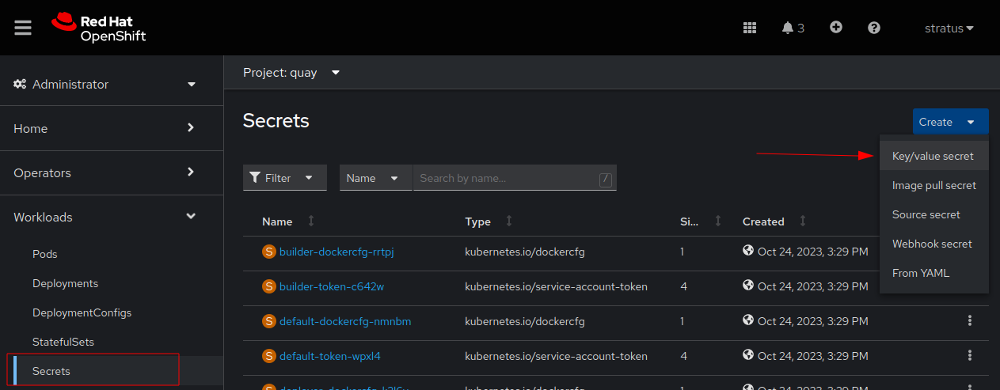

Ensure that the name chosen for this secret is clearly understood and consistent throughout the configuration files. By convention, Red Hat uses `init-config-bundle-secret` as the name of this secret.

> [!WARNING]
> It is very important that the key be exactly `config.yaml`. This is the name of the file that will be mounted into the Quay pods. If the name is wrong Quay will assume it has no configuration and start with a minimal default.

For the value, enter the options you want to utilize in the Quay registry. See [the documentation](https://access.redhat.com/documentation/en-us/red_hat_quay/3.9/html-single/configure_red_hat_quay/index#config-fields-intro) for more options.

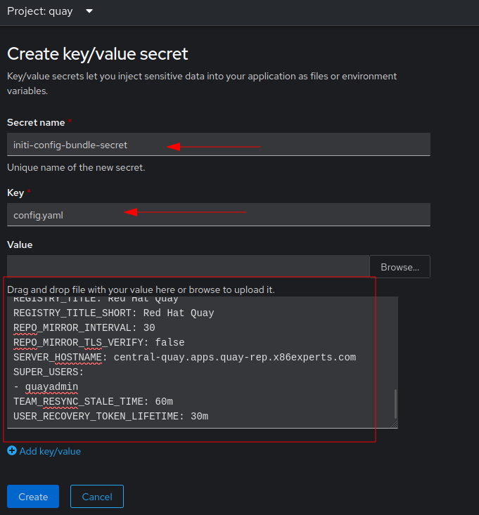

Before proceeding with the installation of the Quay Operator, a project is required. To create a new project, ensure that you are in the `Administrator` view on the left hand menu.

Then click **Home --> Projects --> Create Project** as seen below:

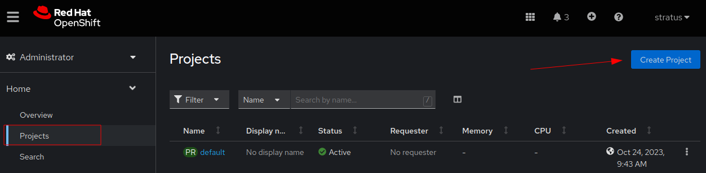

Fill in the project details. By convention Red Hat uses a project starting with the name `quay`. A `Display Name` and `Description` are not required but may be useful for managing large clusters where there are several different groups administering the system. Some organizations may also have certain key words required in the description to meet compliance standards.
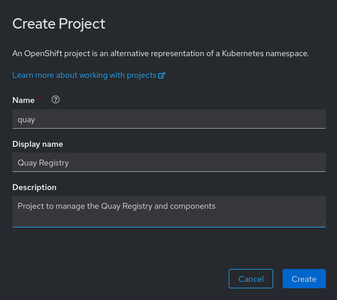

Once satisfied, click `Create` to create the project.

## Quay Config: Create QuayRegistry

After the Quay Operator is confirmed ready, the CRDs are present in the cluster. The next step is to create a `QuayRegistry` Object. Click `Operators --> Installed Operators --> QuayRegistry` tab.

Select `Current namespace only`. While it is possible to install the QuayRegistry object throughout the cluster this is not the recommended practice unless you plan on letting users have their own instance of Quay or you are in a multitenancy environment where you are host discrete instances of Quay to various clients.

Click `Create QuayRegistry`:

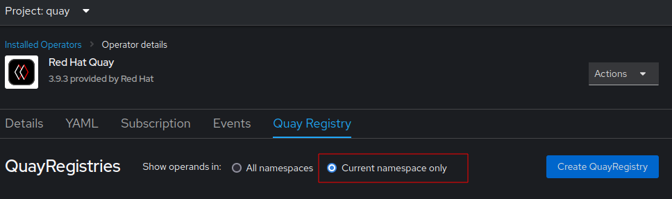

The form view is the default presentation of options in the OpenShift Console. If you have a prepared YAML definition you can toggle the view to `YAML view`. Otherwise enter a name. By convention Red Hat uses the name `central` for Quay instances.

> [!IMPORTANT]
> Make sure that the `init-config-bundle-secret` which was created earlier, is selected. Otherwise Quay will have a minimal default configuration for the initial bootstrapping. Depending on storage and other required options, this could cause the installation to fail.

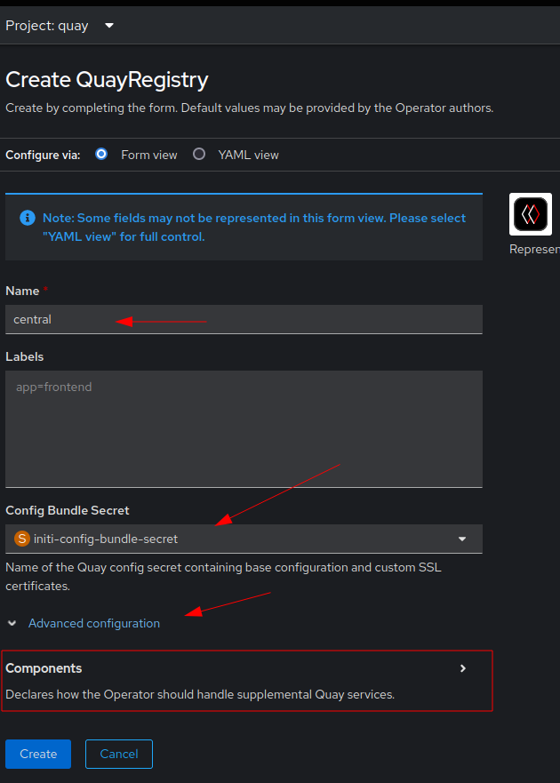

As seen above there is an `Advanced configuration` drop down which can expose the components Quay manages.

Below is an example of modifying the Quay pods themselves to turn on a `DEBUGLOG` as well as reduce the replicas to a single pod.

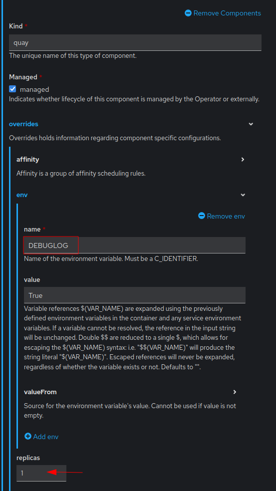

## OPTIONAL: Quay Mirror

Enabling Mirroring in Quay is still a manual process. Because Quay on OpenShift relies heavily on its Postgres database for state syncing and its ability to scale (not to mention Geo Replications), it is currently not possible to do a bulk import of mirror definitions.

### Mirror Prerequisite

Only repositories in an organization can be mirrored. In order to create an organization, login to Quay as a `superuser`. On the main page there is a `+` sign on the far right hand panel which says `Create New Organization`.

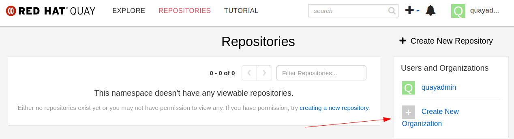

Simply choose the name for the organization and click `Create Organization`.

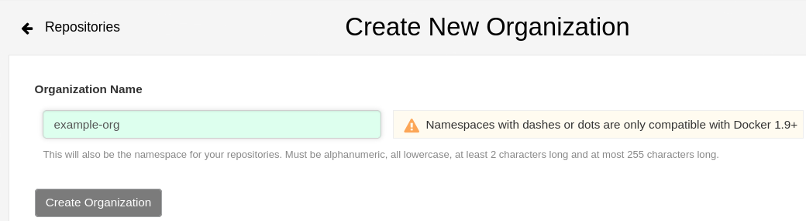

> [!NOTE]
> Organizations rely heavily of their use of `teams` and `owners`. An organization is only visible to its' team members of organization owners.

### OpenShift Quay Mirror Config

> [!IMPORTANT]
> Both the ` FEATURE_REPO_MIRROR: true` in the `init-config-bundle-secret` and the `mirror` option to `managed: true` in the `QuayRegistry` object must be set

In order to edit the QuayRegistry object from the UI, click on **Operators --> Installed Operators --> Red Hat Quay --> ⋮ --> Edit QuayRegistry**

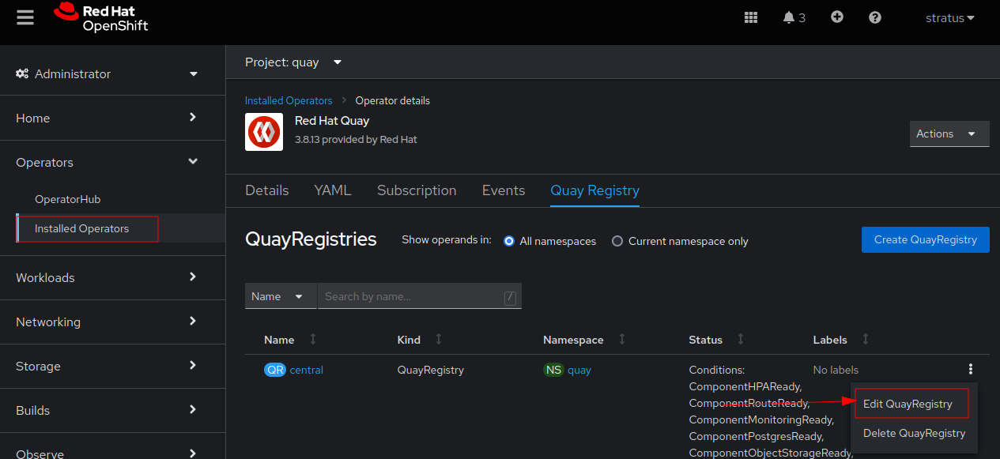

From there, either use the form view or the YAML view to ensure that the `mirror` option is managed by the Quay Operator.

### Quay Test Repo

For this guide, create a test repo inside of the `example-org`. To do so, simply click on the `+ Create New Repository` button.

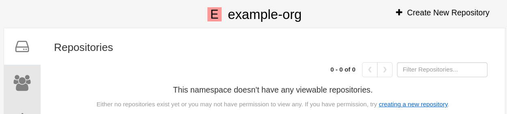

Choose a name for the repo and decide whether or not it should be public.

> [!NOTE]
> If the feature flag `FEATURE_ANONYMOUS_ACCESS` is set to `false` even public repositories will require authentication to pull images. (If unspecified this defaults to `true`)

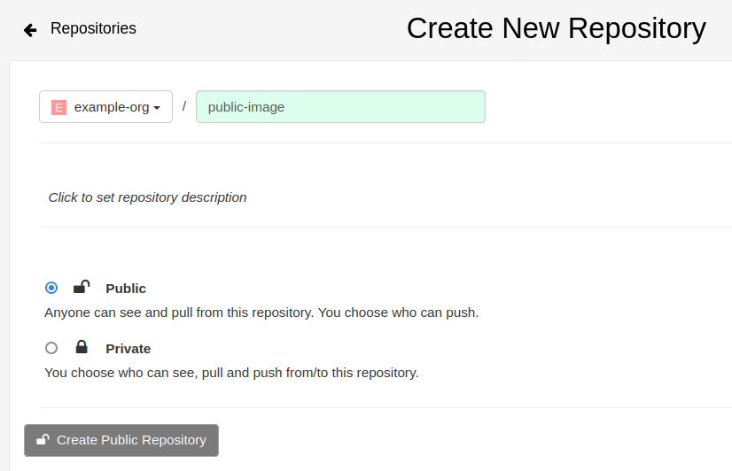

Once the organization has a repo, click on the circular arrows which indicate mirror configuration. By default newly created repos are not created as a mirror.

> [!WARNING]
> If a repo is set as a mirror, Quay treats it as read only! This means the only user that an write images to the repo is the robot account used to initial the mirror.

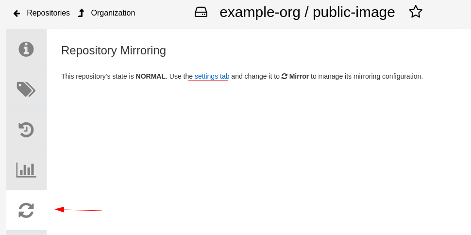

To set a repo to the `Mirror` state, select the gear icon on the left to edit the settings of a repo. Under `Repository State` change the drop down from `Normal` to `Mirror`.

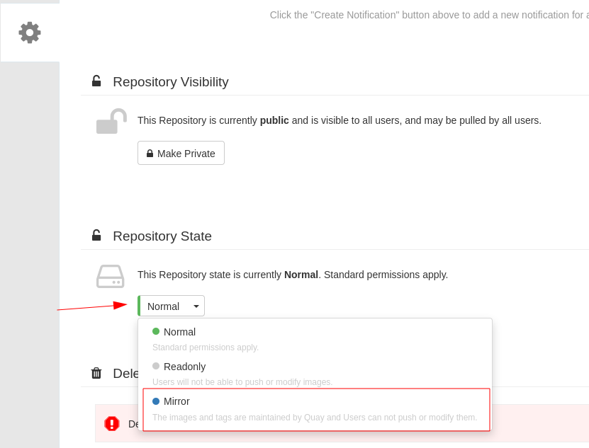

Finally go back to the `Repository Mirror` section (indicated by the circular arrows on the left hand panel) and fill out the information.

> [!NOTE]
> The Robot user is the user Quay will allow to write to the read-only mirror. If one does not exist, the dropdown here will allow you to create one.

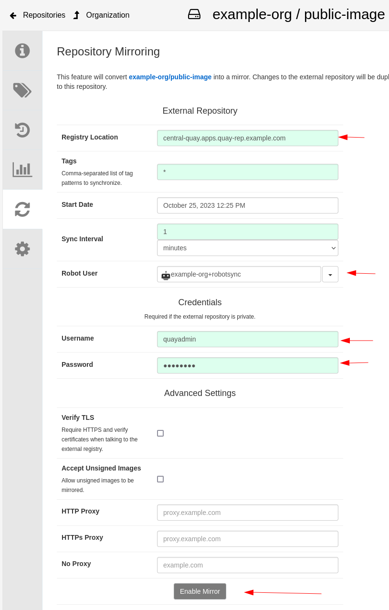

Click `Enable Mirror` to complete the configuration of this repository.

## OPTIONAL: Quay ProxyCache

ProxyCache can be used to both restrict access to external repositories to a single client (the Quay registry itself) as well as provide a caching mechanism so that popular images do not have to be repeatedly downloaded from outside sources.

Assuming that the feature flag `FEATURE_PROXY_CACHE` has been set to `true` in the `init-config-bundle-secret`, the ProxyCache will show up as an option when examining the `Organization Settings` in the Quay UI. Select the 3 gear icon from the left hand panel.


The options are self explanatory. In order to test that the configuration is valid try doing pull with podman:

```
podman login <quay url>
podman pull --tls-verify=false <quay url>/<organizaltion>/<external repository>/<image>:<tag>
```

For example assuming the ProxyCache config is for `quay.io`:

```
podman pull --tls-verify=false <quay url>/example-org/projectquay/quay:3.7.9
```

This should pull the image `quay:3.7.9` from the repo `quay.io/projecctquay` and cache it in the local Quay instance.

### Quotas/Auto Pruning

1. To enable quota management, set the feature flag in your config.yaml to true. You can do this from the OpenShift console UI, by editing the config bundle secret to include the following line and click Save.

```
FEATURE_QUOTA_MANAGEMENT: true
```

2. Ensure that you are logged in as the Super User in Quay then under the Organization, click on the gear and select "Configure Quota"
   

3. Set the storage quota as per your requirements and click "Apply".

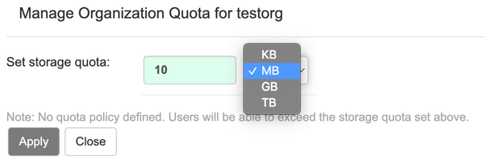

4. Optionally create rejection and warning limits. From the superuser panel, navigate to the Manage Organizations tab. Click the Options icon for the organization and select Configure Quota. In the Quota Policy section, with the Action type set to Reject, set the Quota Threshold

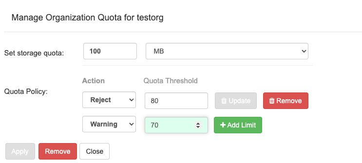

Once the quota is exceeded, previous tags are removed and the most recent are preserved.

# Quay CLI Install

To create the namespace use the following example:

```
echo '
apiVersion: v1
kind: Namespace
metadata:
  name: quay
' | oc create -f -
```

## Quay Config: init-config-bundle-secret

Regardless how which storage option is deployed to enable Quay, the most important thing from an automation perspective is setting up the `init-config-bundle-secret`. This secret (whose name is only `init-config-bundle-secret` by convention) hold the information required to bootstrap Quay. *Most* of Quay's options can be adjusted post-install except for the storage. If OpenShift Data Foundation is not being used to provide the storage, the `init-config-bundle-secret` **needs** to contain the information required for the Quay Operator to create the resources it needs.

### `init-config-bundle-secret` With OpenShift Data Foundation (ODF)

When using ODF, there is no additional information required in the secret. By default (unless altered by the installer) Quay will opt to manage its' own storage requirements and Quay will look for the CRDs provided by ODF. These can be either Noobaa or the Multicloud Object Gateway. Assuming these are already in place, adjust the below configuration adding in the LDAP config, SERVER_HOSTNAME and SUPER_USERS.

> [!NOTE]
> A Quay SUPER USER is just as it sounds. These are the admin users for Quay and at least one is required. If a default, non-SSO user is desired, there are 2 options.
> 1. Set the `FEATURE_USER_CREATION:` to `true`. This allows users to register themselves with Quay. They cannot obtain elevated privileges in this manner. A `SUPER_USERS` definition is still required in the `init-config-bundle-secret`
> 2. Set the `FEATURE_USER_INITIALIZE:` to `true`. This allows an operator to create the initial Quay user via the API by hitting the `/api/v1/user/initialize` end point.

The below config uses the `FEATURE_USER_CREATION: true` to accommodate new user creation.

```
EXTERNAL_TLS_TERMINATION: true
FEATURE_ANONYMOUS_ACCESS: true
FEATURE_CHANGE_TAG_EXPIRATION: true
FEATURE_DIRECT_LOGIN: true
FEATURE_EXTENDED_REPOSITORY_NAMES: true
FEATURE_INVITE_ONLY_USER_CREATION: false
FEATURE_MAILING: false
FEATURE_NONSUPERUSER_TEAM_SYNCING_SETUP: false
FEATURE_PARTIAL_USER_AUTOCOMPLETE: true
FEATURE_PROXY_CACHE: true
FEATURE_PROXY_STORAGE: true
FEATURE_SECURITY_NOTIFICATIONS: true
FEATURE_TEAM_SYNCING: true
FEATURE_USER_CREATION: true
FEATURE_USER_LAST_ACCESSED: true
FEATURE_USERNAME_CONFIRMATION: true
FRESH_LOGIN_TIMEOUT: 10m
LDAP_ADMIN_DN: <user>
LDAP_ADMIN_PASSWD: <password>
LDAP_ALLOW_INSECURE_FALLBACK: true
LDAP_BASE_DN:
- OU=Group1
- DC=example
- DC=com
LDAP_EMAIL_ATTR: mail
LDAP_UID_ATTR: uid
LDAP_URI: ldap://ldap-host.example.com:389
LDAP_USER_RDN:
- OU=Uusers
- OU=Group1
- DC=example
- DC=com
PREFERRED_URL_SCHEME: https
REGISTRY_TITLE: Red Hat Quay
REGISTRY_TITLE_SHORT: Red Hat Quay
SEARCH_MAX_RESULT_PAGE_COUNT: 10
SEARCH_RESULTS_PER_PAGE: 10
SERVER_HOSTNAME: central-quay.apps.ocp.example.com
SETUP_COMPLETE: true
SUPER_USERS:
- user1
- user2
```

### `init-config-bundle-secret` External Object Store

The `init-config-bundle-secret` stays almost identical in this example except for the addition of the storage options.

> [!WARNING]
> If `DISTRIBUTED_STORAGE_DEFAULT_LOCATIONS` and `DISTRIBUTED_STORAGE_PREFERENCE` are not set, Quay will not initialize. The [config.py](https://github.com/quay/quay/blob/master/config.py#L428-L429) within Quay's code base sets these values to `local_us` unless declared. This will cause confusing and misleading errors during Quay's initialization.

```
DISTRIBUTED_STORAGE_CONFIG:
    default:
        - RadosGWStorage
        - access_key: <key>
          bucket_name: <bucket>
          hostname: <host>
          is_secure: false
          port: <port>
          secret_key: <bucket secret key>
          storage_path: <bucket path>
DISTRIBUTED_STORAGE_DEFAULT_LOCATIONS:
    - default
DISTRIBUTED_STORAGE_PREFERENCE:
    - default
```

See the [official documentation](https://docs.projectquay.io/config_quay.html#config-fields-storage) for more example configurations for various storage backends.

## Quay Config: Create QuayRegistry

```
oc create secret generic init-config-bundle-secret --from-file=config.yaml=quay-config.yaml
```

### Create Quay `Subscription`

For Quay, only a generic `Subscription` object is required to install the operator. However, it should be noted that installing the Quay Operator only creates CRDs in the cluster so there are additional steps required before a registry is available.

Below is the `Subscription` for Quay v3.9.2. This file is mostly static save for installing different versions of Quay.

```
echo '
apiVersion: v1
items:
- apiVersion: operators.coreos.com/v1alpha1
  kind: Subscription
  metadata:
    labels:
      operators.coreos.com/quay-operator.openshift-operators: ""
    name: quay-operator
    namespace: openshift-operators
  spec:
    channel: stable-3.9
    installPlanApproval: Automatic
    name: quay-operator
    source: redhat-operators
    sourceNamespace: openshift-marketplace
    startingCSV: quay-operator.v3.9.2
kind: List
metadata:
  resourceVersion: ""
' | oc apply -f -
```

This process will create several CRDs in the cluster as well as creating an operator pod called `quay-operator.v<version>`. This pod is in charge of reconciling various UI and CLI interactions with Quay.

> [!IMPORTANT]
> Red Hat Quay running on top of OpenShift relies heavily on its' Postgres database. While standalone Quay has a lot of options with regards to editing flat files, Quay on OpenShift stores the majority of its information in the database. If changes you make are not being reflected in the pod, its likely there is a problem with the operator.

### Create `QuayRegistry`

The next step required for installing Quay is the `QuayRegistry` object. It consists of a definition of which components should be installed and managed by the Quay Operator. In addition, this object also references the `init-config-bundle-secret` that was created earlier. Generally speaking, the `QuayRegistry` object should be created in whatever namespace/project has been dedicated to holding Quay. Below is a `QuayRegistry` with all of the components installed and managed by the operator:

```
echo '
apiVersion: quay.redhat.com/v1
kind: QuayRegistry
metadata:
  name: central
  namespace: quay
spec:
  configBundleSecret: init-config-bundle-secret
  components:
    - managed: true
      kind: clair
    - managed: true
      kind: postgres
    - managed: true
      kind: objectstorage
    - managed: true
      kind: redis
    - managed: true
      kind: horizontalpodautoscaler
    - managed: true
      kind: route
    - managed: true
      kind: mirror
    - managed: true
      kind: monitoring
    - managed: true
      kind: tls
    - managed: true
      kind: quay
    - managed: true
      kind: clairpostgres
' | oc apply -f -
```

> [!NOTE]
> Any component that is not explicitly listed will be assumed to have a `managed: true` declaration

A more minimalist `QuayRegistry` can be achieved with the following:

```
echo '
apiVersion: quay.redhat.com/v1
kind: QuayRegistry
metadata:
  name: central
  namespace: quay
spec:
  configBundleSecret: init-config-bundle-secret
  components:
    - kind: clair
      managed: false
    - kind: clairpostgres
      managed: false
    - kind: horizontalpodautoscaler
      managed: false
    - kind: mirror
      managed: false
    - kind: quay
      managed: true
        replicas: 1
' | oc apply -f -
```

Obviously, the above is meant for testing only. Setting the `quay` pod to a single replica is ***NOT*** a recommended production configuration.

> [!IMPORTANT]
> debug logs for Quay components are turned on by adjusting the `QuayRegistry` object. For example if debugging is needed for the quay pod from the above definition, it would look like this:
>
> ```
>    - kind: quay
>      managed: true
>      overrides:
>        env:
>        - name: DEBUGLOG
>          value: "True"
>        replicas: 1
> ```

## OPTIONAL: Quay Mirror

Quay has the ability to mirror specific repositories. By default the `QuayRegistry` object has the `managed: true` option set. However, if you are adding capability to a minimal Quay instance, the `QuayRegistry` needs to have the following section added in addition to what may already be in the object:

```
spec:
  components:
    - kind: mirror
      managed: true
    ...
```

In addition, the `init-config-bundle-secret` should have a line that reads `FEATURE_REPO_MIRROR: true` in order for the mirroring options to be displayed in the Quay UI.

Unfortunately, the rest of the mirror configuration has to be done via the webUI and there is no bulk import of repositories that may wish to be mirrored. A [program](../../apps/quay_sync/README.md) was created to address these shortcomings.

## OPTIONAL: Quay ProxyCache

From a CLI perspective, there is very little that can be accomplished with the native tooling when it comes to setting up the ProxyCache. As with mirroring, a feature needs to be turned on in the `init-config-bundle-secret` in order to use this feature. Make sure that the following feature flag is set:

```
FEATURE_PROXY_CACHE: true
```

The only option for creating ProxyCache from the command line is using the API. The [python program](../../apps/quay_sync/README.md) in this repo can be used to address this.
